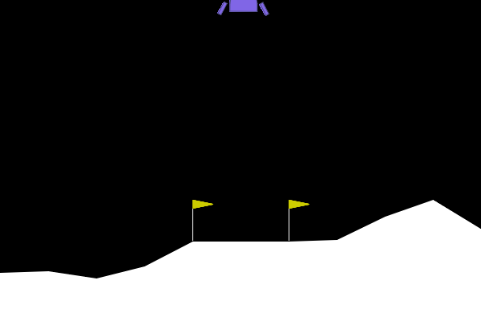
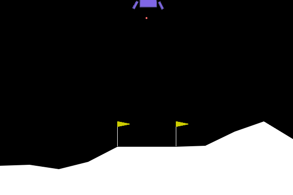
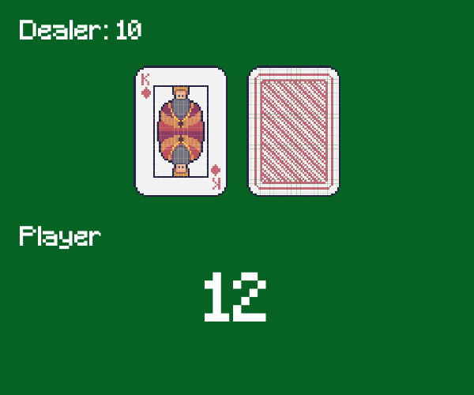
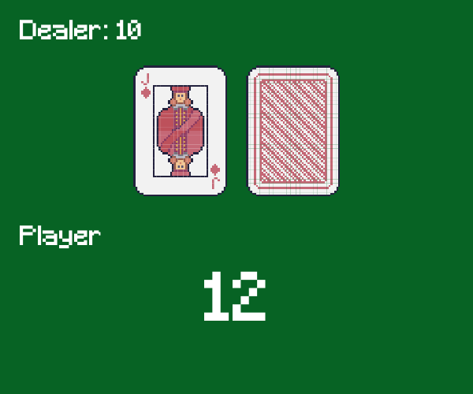
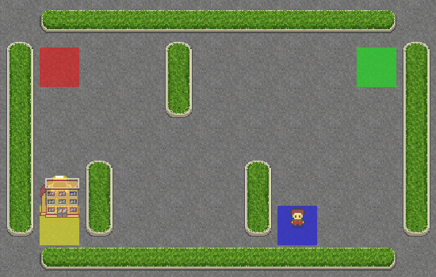

# Gym LLM
The purpose of this repository is to facilitate the deployment of LLM-powered agents that interacts with `gymnasium` environments by reflecting on its previous observations and actions.
The agents can be powered by `OpenAI` models or any local model that is integrated in `Ollama`. 


> [!NOTE] 
> As inference is hardware and model size dependant, real time environments are not a proper use case (high action rates: e.g. 20fps). However, real time environments are tested as if the inference was fast enough. LLM agents should be suitable for high level control and planning, with low action rates!

The library offers:
- `LLMEnv`: A base class to adapt `gymnasium` environments by defining the minimum requirements for the agent to interact with the environment: observation schema, action schema and goal description.
- `Agent`: An agent class to ask for actions based on the previous observations and actions.
- `run_experiment`: A utility function to run the experiment with the configuration file.
- `parse_config`: A function to parse the configuration file.

## Installation
To install the `gym-llm` package, run the following command:
```bash
cd gym-llm
pip install .
```

## Environments
Every environment must inherit from both `gymnasium.Env` and `gym_llm.LLMEnv` to implement every `abstractmethod`.

- You must define `get_observation_schema()`, `get_action_schema()` and `get_goal_description()` so the agent
can receive that information as the `system_prompt`.
- To make it easy for the agent, it can only receive `gymnasium.spaces.Dict` observations. In that way, the `observation_schema` comes to help with further description of each field. The decision to not accept 
pure `gymnasium.spaces.Box` type is to guarantee a richer and more understandable observation prompt. 
- The actions can only be `gymnasium.spaces.Discrete` for now, as LLM fail on float numbers (e.g. 9.11 is higher than 9.9?). It may be extended in the future to other spaces.

## Configuration file
```yaml
agent:
    backend: 'ollama'             # 'ollama' or 'openai'
    model: 'llama3.1'             # llm model, should be available on the backend
    temperature: .8               # creativity
    history: 10                   # history window
    action_rate: 1                # how many frames to skip without any action

environment:
    name: 'LunarLanderLLM-v2'     # name of the registered environment
    kwargs: null                  # extra args for the environment
  
experiment:
    parent: 'experiments'         # parent folder
    name: 'lunar_lander_llama3.1' # experiment name
    use_datetime: true            # append datetime to the name
    seed: 0                       # seed for reproducibility
    save_gif: true                # save gif of the run
    gif_fps: 30                   # gif frames per second
    num_runs: 1                   # number of runs
    verbose: true                 # print information  
```

## Usage
You can create your custom loop to interact with the environment and the agent. Here is an example:
```python
import your_env_registry
import gym_llm

config = gym_llm.parse_config(path=Path('./configs/lunar_lander.yaml'))
env = gym_llm.get_env(env_config=config.get('environment'), render_mode='human')
agent = gym_llm.Agent(config=config.get('agent'),
              **gym_llm.get_env_definition(env))

obs, _ = env.reset(seed=seed)
agent.reset(seed=seed)
done = False
total_reward = 0
num_steps = 0

while not done:
    raw_output, action = agent.get_action(obs)
    obs, reward, terminated, truncated, _ = env.step(action)
    total_reward += reward
    num_steps += 1
    done = terminated or truncated
```

Or you can use the `run_experiment` function to run the experiment with the configuration file as shown in the `main.py` file. Just change the configuration file path to your own.

```bash
python main.py
```
If using this utility function, there will be created a folder with the gif of each run, the raw outputs of the llm, the results metrics and the configuration file used.

### Examples
#### Mountaincar-v2
```json
{
  "5": {
    "reflection": "The lander's y-coordinate is still decreasing but at a slower rate, and its x-coordinate and z-coordinate are increasing. The lander's angular velocity has changed direction, now pointing in the positive angular direction. This could indicate that the lander is starting to descend or level out.",
    "action": 0
  },
  "6": {
    "reflection": "The lander's descent is accelerating with the y-coordinate continuing to decrease and its z-coordinate increasing. The angular velocity remains in a positive direction, indicating the lander is likely to continue descending.",
    "action": 0
  },
  "7": {
    "reflection": "The lander's descent is becoming more steep with the y-coordinate decreasing rapidly and its z-coordinate increasing significantly. The angular velocity remains positive, indicating a likely continued downward trajectory.",
    "action": 1
  },
  "8": {
    "reflection": "The lander's descent is becoming even more steep with the y-coordinate decreasing rapidly and its z-coordinate increasing significantly. The angular velocity has increased in magnitude, but still points in a positive direction. This could indicate that the lander is starting to correct its course or prepare for landing.",
    "action": 1
  }
}
```
```json
{
    "total_rewards": [
        21.994503894092517
    ],
    "total_steps": [
        60
    ],
    "avg_reward": 21.994503894092517,
    "avg_steps": 60.0
}
```

#### Blackjack-v1
```json
{
    "1": {
        "reflection": "Since the player's sum is already high (19) and they have no usable ace, hitting might result in a bust. Sticking with a sum of 19 is a safe choice.",
        "action": 0
    }
},
{
    "1": {
        "reflection": "Since the player's sum is already 21 and there is a usable ace, hitting would either bust the player or not change their score. Sticking with a sum of 21 is likely to result in a win.",
        "action": 0
    }
},
{
    "1": {
        "reflection": "Since the player's current sum is 7 and the dealer's showing card is a 10 (which has a value of 10), hitting would likely increase the player's risk of going over 21. However, sticking with a sum of 7 might also be too low to compete with the dealer's potential hand. Considering the player has no usable ace, it seems like hitting could provide more opportunities for improvement.",
        "action": 1
    },
    "2": {
        "reflection": "The player's current sum is 17, which is already a strong hand. Given that the dealer's showing card is a 10 and there are no usable aces for the player, sticking with a sum of 17 seems like the most prudent choice to avoid going over 21 and minimize potential losses.",
        "action": 0
    }
}
```

## Results
To avoid paying too much on the OpenAI API, if a first debug run does not show any chance to complete the environment, then the experiment is considered as done.

| **Environment** |    **LLM**    | **Avg reward** | **Avg steps** | **Action rate** | **Initial seed** | **% of successful runs** | **Num of runs** |                 **Gif**                  |
|:---------------:|:-------------:|:--------------:|:-------------:|:---------------:|:----------------:|:------------------------:|:---------------:|:----------------------------------------:|
| LunarLander-v2  | `gpt-4o-mini` |       -        |       -       |        1        |        0         |            0%            |        1        |  |
| LunarLander-v2  | `llama3.1-8B` |    -391.20     |     79.2      |        1        |        0         |            0%            |        5        |    |
|  Blackjack-v1   | `gpt-4o-mini` |      0.1       |      1.8      |        1        |        0         |           50%            |       10        |     |
|  Blackjack-v1   | `llama3.1-8B` |      -0.1      |      1.5      |        1        |        0         |           40%            |       10        |       |
|     Taxi-v3     | `gpt-4o-mini` |      -374      |      50       |        1        |        0         |            0%            |        1        |          |
|     Taxi-v3     |   `gpt-4o`    |      -50       |      50       |        1        |        0         |            0%            |        1        |              |
|     Taxi-v3     | `llama3.1-8B` |      -491      |      50       |        1        |        0         |            0%            |        1        |            |

> [!NOTE] 
> For the taxi env, the max_steps_per_episode var has been set to 50 in order have more tests and see if there were any "smart" behaviour. I tried `gpt-4o` to see if a better model solved the environment. As
> you can see, the agent "moves", but still very stupid!

## Future work
- Better rendering: img and llm reasoning on the same window
- Comparison against reinforcement learning agents
- Add more environments

## Conclusion
LLMs does not behave well for continuous observation spaces and low level control. On the other hand, it shows great potential for high level control and planning tasks (quite easy ones).
As there is no training, using LLM agents for this tasks could be a great alternative to reinforcement learning agents! Using opensource models have shown to be more than enough for the tasks tested (that it solved).
Future models will be more powerful and hope they are able to solve all these tasks!

> [!NOTE] 
> If you have the hardware to run more experiments with better models feel free to contribute!

## Citation
If you find `gym-llm` useful, please consider citing:

```bibtex
  @misc{2024gymllm,
    title     = {Gym LLM},
    author    = {Rodrigo Sánchez Molina},
    year      = {2024},
    howpublished = {https://github.com/rsanchezmo/gym-llm},
  }
```

You can reach out by email: `rsanchezm98@gmail.com`